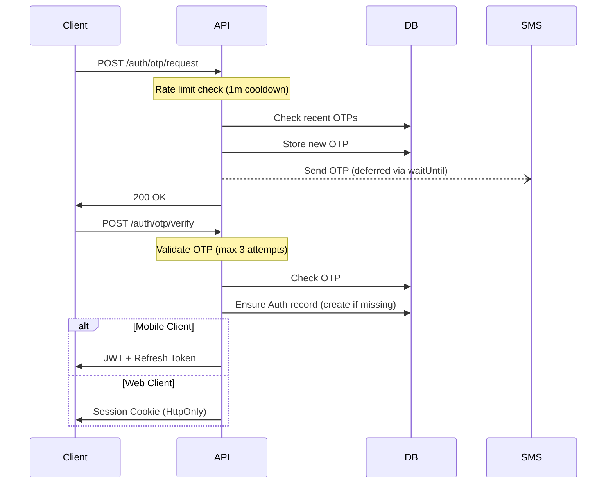
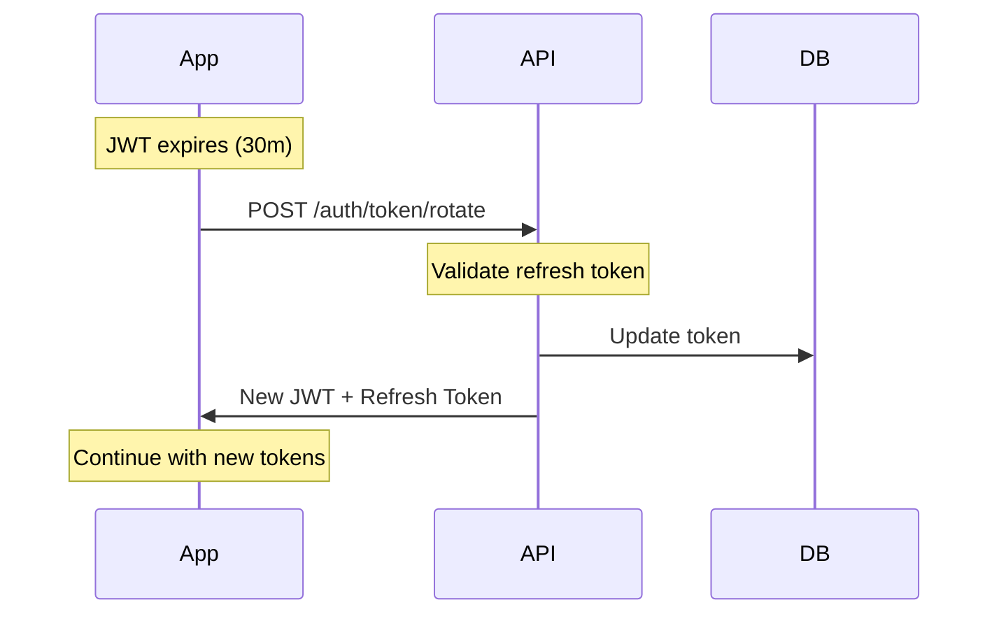
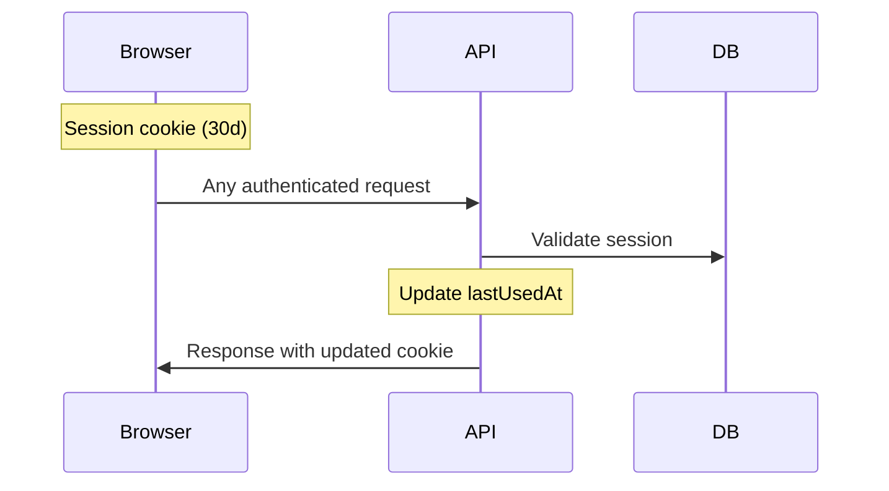
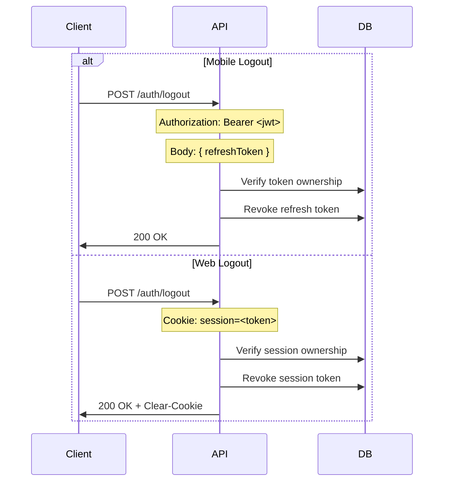
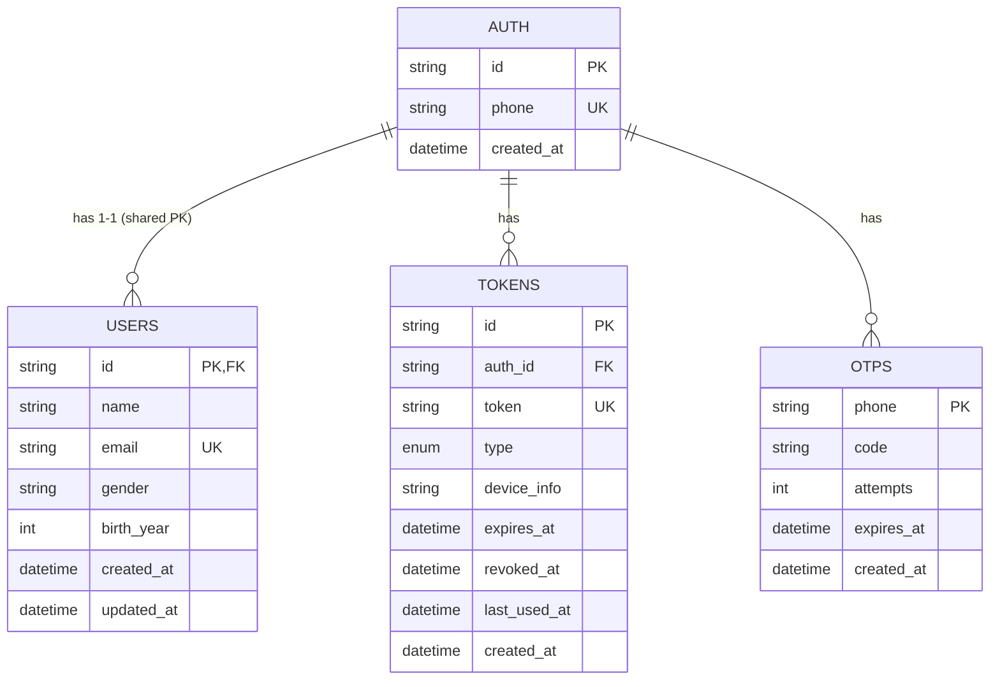

# Architecture Guide

## Authentication System

The Lalbag API implements a dual authentication strategy optimized for both mobile and web clients.

### Authentication Lifecycle

#### 1. Initial Authentication (OTP Flow)



#### 2. Mobile Authentication Flow



## Code Organization

- Business logic handlers live in `src/handlers` (e.g., `users`, `products`, `orders`, etc.).
- Cross-cutting/auth-only logic lives in `src/modules/auth` (handlers, middleware, utils specific to authentication).
- Shared middleware in `src/middlewares`, shared utilities in `src/utils`, external adapters in `src/adapters`.
- This separation keeps business routes independent from authentication internals and avoids tight coupling.

#### 3. Web Authentication Flow



#### 4. Logout Flow



### API Reference

| Endpoint             | Method | Headers | Body                                                 | Response                                                | Auth Required |
| -------------------- | ------ | ------- | ---------------------------------------------------- | ------------------------------------------------------- | ------------- |
| `/auth/otp/request`  | POST   | -       | `{ phone: string }`                                  | `{ ok: true, data: { message } }`                       | ❌            |
| `/auth/otp/verify`   | POST   | -       | `{ phone, code, platform, deviceInfo? }`             | `{ ok: true, data: { jwt?, refreshToken?, message? } }` | ❌            |
| `/auth/token/rotate` | POST   | -       | `{ refreshToken }`                                   | `{ ok: true, data: { jwt, refreshToken } }`             | ❌            |
| `/auth/logout`       | POST   | -       | `{ refreshToken? }` (mobile)                         | `{ ok: true, data: { message } }`                       | ❌            |
| `/users`             | POST   | -       | `{ name, gender, birthYear, email?, refreshToken? }` | `{ ok: true, data: { ...profile }, message }`           | ❌            |

#### Request/Response Details

**OTP Request:**

```typescript
// Request
POST /auth/otp/request
{
  "phone": "01712345678"  // Bangladesh format
}

// Response
{
  "ok": true,
  "data": { "message": "OTP sent" }
}
```

**OTP Verify:**

```typescript
// Request
POST /auth/otp/verify
{
  "phone": "01712345678",
  "code": "123456",
  "platform": "mobile",  // "mobile" | "web"
  "deviceInfo": "iPhone 15 Pro"  // optional
}

// Response (Mobile)
{
  "ok": true,
  "data": {
    "jwt": "eyJ...",
    "refreshToken": "clh..."
  }
}

// Response (Web)
{
  "ok": true,
  "data": { "message": "Logged in" }
}
// + Set-Cookie: session=clh... (HttpOnly, SameSite=Strict; Secure in production)
```

**Token Rotation:**

```typescript
// Request
POST /auth/token/rotate
{
  "refreshToken": "clh..."
}

// Response
{
  "ok": true,
  "data": {
    "jwt": "eyJ...",
    "refreshToken": "clh..."  // New refresh token
  }
}
```

**Logout:**

```typescript
// Request (Mobile)
POST /auth/logout
{
  "refreshToken": "clh..."
}

// Request (Web)
POST /auth/logout   // uses session cookie automatically

// Response
{
  "ok": true,
  "data": { "message": "Logged out" }
}
// + Clear-Cookie: session (Web only)
```

**Profile Create:**

```typescript
// Request (choose one auth method; no middleware auth required)
POST /users
// With session cookie (web), or body refresh token (mobile)
{
  "name": "Jane Doe",
  "gender": "female",
  "birthYear": 1995,
  "email": "jane@example.com",
  "refreshToken": "clh..."      // optional
}

// Response
{
  "ok": true,
  "data": { /* users row */ },
  "message": "Profile created"
}
```

### Security Design

#### 1. OTP Security

- **Rate Limiting**: 1-minute cooldown between requests
- **Attempt Limiting**: Maximum 3 attempts per OTP
- **Auto Cleanup**:
  - Delete after successful verification
  - Delete after max attempts
  - Delete after expiry

#### 2. Token Security

**Mobile (JWT + Refresh Token):**

- JWT: 30-minute expiry (stateless)
- Refresh Token: 30-day expiry, single-use
- Token Rotation: Always allowed with valid refresh token
- Update in place (not revoke + create)

**Web (Session Cookie):**

- 30-day expiry
- HttpOnly, SameSite=Strict
- Secure in production; in local development `secure` may be disabled for DX
- Activity tracking with lastUsedAt

#### 3. Refresh Token Lifecycle

**Active User Behavior:**

1. **Initial Login**: User receives a JWT (30-minute expiry) and a refresh token (30-day expiry)
2. **Proactive Rotation**: Client rotates tokens 2-5 minutes before JWT expiry to get new JWT + refresh token
3. **Continuous Extension**: Active users never need to re-login (refresh token expiry keeps extending)
4. **Dormant Users**: Only users inactive for 30+ days need to re-login

**Example Timeline:**

```
Day 1: Login → Refresh token expires Day 31
Day 15: Rotate (25min) → Refresh token expires Day 45
Day 30: Rotate (28min) → Refresh token expires Day 60
Day 45: Rotate (26min) → Refresh token expires Day 75
... (continues indefinitely for active users)
```

**Client Implementation Logic:**

```typescript
// Client-side rotation logic
const JWT_EXPIRY_MINUTES = 30
const SAFETY_BUFFER_MINUTES = 5

if (jwtExpiresIn < SAFETY_BUFFER_MINUTES * 60 * 1000) {
	// Rotate 5 minutes before expiry for safety
	await rotateToken()
}
```

**Security Implications:**

- **UX Benefit**: Active users stay logged in seamlessly
- **Security Consideration**: Long-lived sessions require additional monitoring
- **Mitigation**: Manual revocation, device limits, activity-based expiry

### Database Model



### Error Handling

#### OTP Errors

- 429: Too many requests (cooldown period)
- 401: No OTP found
- 401: OTP expired
- 401: Invalid OTP code
- 401: Too many attempts

#### Token Errors

- 401: Invalid/expired JWT
- 401: Invalid/expired refresh token
- 401: Invalid session

### Database Maintenance

```sql
-- Regular cleanup (run daily)
DELETE FROM tokens WHERE expires_at < NOW();
DELETE FROM otps WHERE expires_at < NOW();
```

### Security Considerations

1. **Token Lifecycle**
   - Old JWT valid until expiry (30m window)
   - Standard behavior for JWT systems
   - Acceptable security trade-off

2. **Refresh Token Security**
   - **Long-lived sessions**: Active users stay logged in indefinitely
   - **Activity-based expiry**: Consider expiring after 30 days of inactivity
   - **Device limits**: Limit concurrent sessions per user
   - **Manual revocation**: Users can revoke tokens from settings
   - **Suspicious activity**: Auto-revoke on suspicious patterns

3. **Race Conditions**
   - Token updates use single atomic operation
   - OTP attempts tracked atomically
   - UTC timestamps prevent timezone issues

4. **Data Protection**
   - No sensitive data in JWTs
   - Secure cookie configuration
   - Proper database relationships

### Client Implementation

#### Mobile (React Native)

```typescript
// Secure storage (MMKV)
const secureStorage = {
	setToken: async (key: string, value: string) => {
		authStorage.set(key, value)
	},
	getToken: async (key: string) => {
		return authStorage.getString(key) ?? null
	},
}

// Auto refresh on 401
async function fetchProtected(url: string) {
	const jwt = await secureStorage.getToken("jwt")
	const response = await fetch(url, {
		headers: { Authorization: `Bearer ${jwt}` },
	})

	if (response.status === 401) {
		await refreshToken()
		const newJwt = await secureStorage.getToken("jwt")
		return fetch(url, {
			headers: { Authorization: `Bearer ${newJwt}` },
		})
	}
	return response
}
```

#### Web (SvelteKit)

```typescript
// Automatic cookie handling
async function fetchProtected(url: string) {
	const response = await fetch(url, {
		credentials: "include", // Includes session cookie
	})
	return response
}
```

### Route Handler Pattern

#### Getting Authenticated User

```typescript
// Authenticated route handler
const getUserProfile = async (c: Context) => {
	const userId = c.get("user").id // From requireAuth (same as users.id)

	const profile = await db.select().from(users).where(eq(users.id, userId))

	return res.ok(c, profile)
}

// Register with requireAuth
app.get("/profile", requireAuth, getUserProfile)
```

> **Note:** The `userId` is guaranteed to exist if `requireAuth` passes. No additional validation needed.

**Token Possession Helper:**

The API also supports possession-based authentication for specific flows (e.g., `POST /users` profile creation), where either a refresh token (mobile) or a session cookie (web) is presented. The helper `getUserIdFromTokenOrSession(c, refreshToken?)` centralizes this logic so handlers don't duplicate it.
